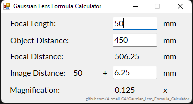

# Gaussian_Lens_Formula_Calculator
If you want to DIY a helicod or a macro extension tube for a lens this may be helpful.

Object Distance - the distance between the object being focused and the optical center of the lens

Focal Distance - the distance between the object being focused and the camera sensor

Image Distance - the distance between the optical center of the lens and the camera sensor

Magnification - the ratio of the height of the image to the height of the object being focused

Input the Focal Length and the Object Distance  
OR input the Focal Length and the Image Distance  
Then press ENTER to get other values  

Build passed on Visual Studio 2022, .NET Framework 4. 
